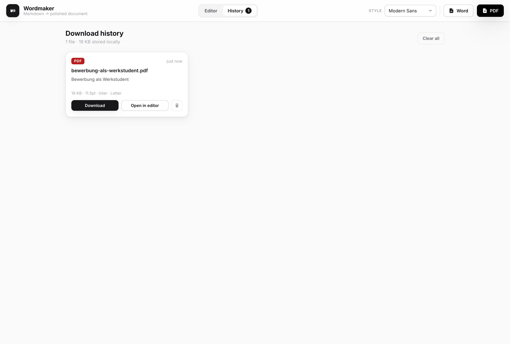

<div align="center">

# Wordmaker

### Paste Markdown → get a beautifully formatted **`.docx`** or **`.pdf`**

Choose the font, title size, line height, spacing and margins — Wordmaker lays it
out cleanly and exports a real Word document or a self-made, print-ready PDF.
Everything runs **locally in your browser**: your text never leaves your machine.


<sub>Local-first · cross-platform (macOS + Windows) · installable as an app · no sign-in</sub>

</div>

---

## ✨ Features

- **Live preview** — type Markdown on the left, see the formatted page on the right.
- **Real `.docx` export** — generated with the [`docx`](https://docx.js.org) engine: proper headings, lists, tables, blockquotes and styles, not a screenshot.
- **Self-contained `.pdf` export** — drawn directly with [jsPDF](https://github.com/parallax/jsPDF), so there is **no browser print chrome** (no `localhost`, no date, no page-title bar). Wordmaker draws its own optional header/footer instead.
- **Page options you control** — toggle a centered title header, a footer, page numbers, and pagination (multi-page vs. one continuous page), plus your own editable footer text.
- **Download history** — every file you export is saved locally (IndexedDB). Browse it on the History page to re-download, re-open in the editor, or delete any item.
- **Full typographic control** — font, body size, **title size**, line height, paragraph gap, page margins, Letter / A4.
- **5 ready-made styles** — Modern Sans, Classic Serif, Academic, Clean Report, Compact.
- **Black-and-white, depth-first design** — restrained, modern, with soft layered shadows.
- **Keyboard-friendly** — ⌘/Ctrl-S for Word, ⌘/Ctrl-P for PDF.

## 🖼️ Screenshots

<table>
  <tr>
    <td width="50%" valign="top">
      <strong>The exported PDF — fully self-made</strong><br/>
      <em>Centered title header, footer link bottom-left, page number bottom-right. No browser <code>localhost</code> chrome.</em><br/><br/>
      
    </td>
    <td width="50%" valign="top">
      <strong>Download history</strong><br/>
      <em>Every export is saved locally — re-download, re-open, or delete any time.</em><br/><br/>
      
    </td>
  </tr>
</table>

## 🤔 Why a web app and not a Chrome extension?

A paste-and-export tool needs **no** access to web pages, so a browser extension
would only add Chrome-lock and store friction. A web app is cross-platform,
installable as a PWA (own window + icon), fully offline/private, and — because
the PDF is generated in code rather than printed — produces a clean document
with exactly the header/footer you choose and nothing the browser adds.

## 🚀 Quick start

```bash
npm install
npm run dev      # open the printed http://localhost:5173
```

Build a static, self-contained version you can host anywhere (or even open the
file directly):

```bash
npm run build    # outputs dist/
npm run preview  # serve the build at http://localhost:4173
```

Run the checks (Markdown → `.docx` validity, and PDF correctness incl. “no
browser chrome”):

```bash
npm test
```

## 📝 Using it

1. Paste or type Markdown in the left pane.
2. Pick a **Style**, or fine-tune the font / sizes / spacing / margins in the rail.
3. Under **Output**, toggle the header, footer, page numbers and pagination, and set the footer text.
4. Click **Word** or **PDF** — the file downloads and is added to **History**.

| Shortcut | Action |
| --- | --- |
| `⌘ / Ctrl` + `S` | Export Word (`.docx`) |
| `⌘ / Ctrl` + `P` | Export PDF |
| `Tab` (in editor) | Insert two spaces |

**Supported Markdown:** headings, **bold** / *italic* / ~~strikethrough~~, inline
`code` and fenced code blocks, ordered / unordered / nested / task lists, links,
blockquotes, tables, and horizontal rules.

## 🧱 Tech stack

- [Vite](https://vitejs.dev) + TypeScript — small, fast, zero-framework. Exporters are code-split and lazy-loaded.
- [`marked`](https://marked.js.org) — Markdown parsing (HTML for preview, tokens for export).
- [`docx`](https://docx.js.org) — Word document generation, fully in-browser.
- [`jsPDF`](https://github.com/parallax/jsPDF) — PDF generation, fully in-browser.
- IndexedDB — local, persistent download history.

## 📂 Project structure

```
src/
  main.ts          UI state, controls, live preview, view switching, events
  markdown.ts      Markdown → HTML (preview) and → tokens (export)
  pdf-export.ts    token tree → PDF layout engine (jsPDF)
  docx-export.ts   token tree → Word document model (docx)
  doc-title.ts     title / filename derivation
  download.ts      blob download helper
  history.ts       IndexedDB-backed download history (store the blobs)
  history-view.ts  the History page
  typography.ts    shared heading-size scale (preview + exports agree)
  presets.ts       fonts, styles, sample document
  types.ts         settings + page-output options
  style.css        the black-and-white design system
test/              Markdown → .docx and → .pdf checks
scripts/shots.mjs  verify the exported PDF and refresh README screenshots
```

## 📥 Install as a desktop app

Open the app in Chrome/Edge → address-bar **Install** icon (or menu → *Install
Wordmaker*). On macOS Safari: *File → Add to Dock*. You get a standalone window
with its own icon on both platforms.

## License

MIT
