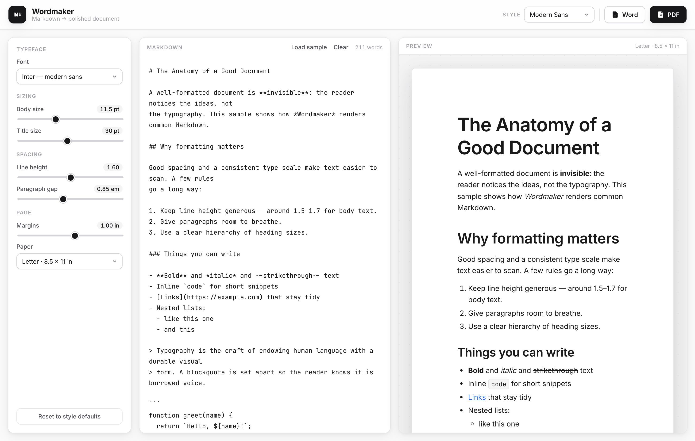
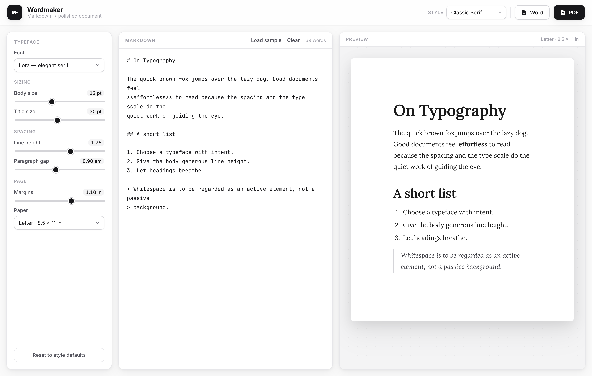
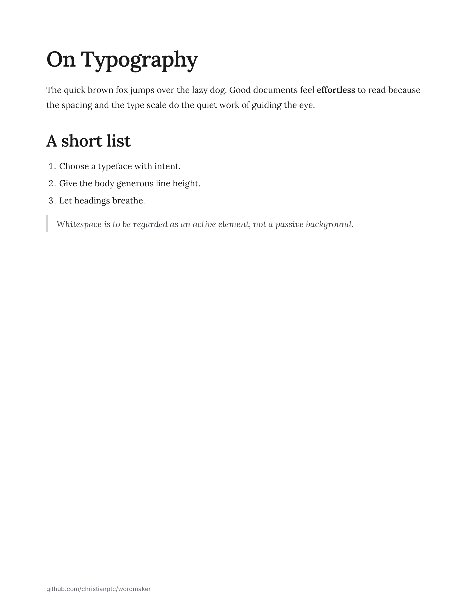

<div align="center">

# Wordmaker

### Paste Markdown → get a beautifully formatted **`.docx`** or **`.pdf`**

Choose the font, title size, line height, spacing and margins — Wordmaker lays it
out cleanly and exports a real Word document or a crisp, print-ready PDF.
Everything runs **locally in your browser**: your text never leaves your machine.



<sub>Local-first · cross-platform (macOS + Windows) · installable as an app · no sign-in</sub>

</div>

---

## ✨ Features

- **Live preview** — type Markdown on the left, see the formatted page on the right.
- **Real `.docx` export** — generated with the [`docx`](https://docx.js.org) engine: proper headings, lists, tables, blockquotes and styles, not a screenshot.
- **Crisp `.pdf` export** — uses the browser's own print engine, so text stays vector-sharp and selectable, and matches the preview exactly. Every page is stamped with a small repo-link footer at the bottom-left.
- **Full typographic control** — font, body size, **title size**, line height, paragraph gap, page margins, and Letter / A4.
- **5 ready-made styles** — Modern Sans, Classic Serif, Academic, Clean Report, Compact.
- **Black-and-white, depth-first design** — restrained, modern, with soft layered shadows.
- **Remembers your work** — last document and settings are stored locally.
- **Keyboard-friendly** — ⌘/Ctrl-S for Word, ⌘/Ctrl-P for PDF.

## 🖼️ Screenshots

<table>
  <tr>
    <td width="50%" valign="top">
      <strong>Switch styles instantly</strong><br/>
      <em>Classic Serif (Lora) with a wider line height.</em><br/><br/>
      
    </td>
    <td width="50%" valign="top">
      <strong>What the PDF looks like</strong><br/>
      <em>Note the repo link printed bottom-left.</em><br/><br/>
      
    </td>
  </tr>
</table>

## 🤔 Why a web app and not a Chrome extension?

A paste-and-export tool needs **no** access to web pages, so a browser extension
would only add Chrome-lock and store friction. A web app is:

- **Cross-platform** — identical on macOS and Windows in any modern browser.
- **Installable** — add it as a standalone app (own window + icon) via your browser's *Install* option / *Add to Dock*.
- **Private & offline** — 100% client-side, no server, no upload.
- **Higher fidelity** — `docx` for Word and the native print engine for PDF beat anything an extension sandbox could do.

## 🚀 Quick start

```bash
npm install
npm run dev      # open the printed http://localhost:5173
```

Build a static, self-contained version you can host anywhere (or even open the
file directly):

```bash
npm run build    # outputs dist/
npm run preview  # serve the build at http://localhost:4173
```

Verify the Markdown → `.docx` pipeline:

```bash
npm test         # builds 8 documents and checks each is a valid .docx
```

## 📝 Using it

1. Paste or type Markdown in the left pane.
2. Pick a **Style**, or fine-tune the font / sizes / spacing / margins in the rail.
3. Click **Word** or **PDF**.
   - For PDF, choose **Save as PDF** (macOS) or **Microsoft Print to PDF** (Windows) in the print dialog.

| Shortcut | Action |
| --- | --- |
| `⌘ / Ctrl` + `S` | Export Word (`.docx`) |
| `⌘ / Ctrl` + `P` | Export PDF |
| `Tab` (in editor) | Insert two spaces |

**Supported Markdown:** headings, **bold** / *italic* / ~~strikethrough~~, inline
`code` and fenced code blocks, ordered / unordered / nested / task lists, links,
blockquotes, tables, and horizontal rules.

## 🧱 Tech stack

- [Vite](https://vitejs.dev) + TypeScript — small, fast, zero-framework.
- [`marked`](https://marked.js.org) — Markdown parsing (HTML for preview, tokens for export).
- [`docx`](https://docx.js.org) — Word document generation, fully in-browser.
- Browser print engine — PDF generation.

## 📂 Project structure

```
src/
  main.ts          UI state, controls, live preview, events
  markdown.ts      Markdown → HTML (preview) and → tokens (export)
  docx-export.ts   token tree → Word document model
  pdf-export.ts    print-engine PDF export + footer link
  typography.ts    shared heading-size scale (preview + docx agree)
  presets.ts       fonts, styles, sample document
  style.css        the black-and-white design system
test/docx.test.ts  end-to-end Markdown → .docx checks
scripts/shots.mjs  regenerate the README screenshots
```

## 📥 Install as a desktop app

Open the app in Chrome/Edge → address-bar **Install** icon (or menu → *Install
Wordmaker*). On macOS Safari: *File → Add to Dock*. You get a standalone window
with its own icon on both platforms.

## License

MIT
